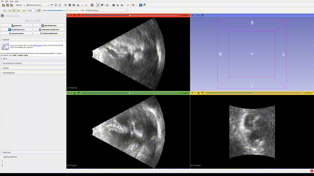

This ultrasound dicom loader utilize a Windows API from GE, to load GE ultrasound data. 

  

# GE ultrasound loader
In Windows:

- https://www.python.org/downloads/
  - install python

- install Visual Studio Code

- https://www.gehealthcare.com/products/ultrasound-developer-program
  - click "ULTRASOUND SOFTWARE DEVELOPER SIGNUP"
  - then will receive an email giving access to the GitHub code below
- https://github.com/GEUltrasound/GE_CVUS_Loader/releases
  - download GE_CVUS_Loader-3.39.3.zip 
  - unzip it

- in Windows search bar, type "terminal", right click to "Run as administrator"
  - cd to folder "[some_path]\GE_CVUS_Loader-3.39.3\bin64"
  - regsvr32 Image3dLoaderGe.dll

- open Visual Studio Code
  - open folder "code"
  - run main.py 
  - install the needed modules
    - pip install comtypes
    - pip install "pydicom<3.0" (NOTE: because pydicom version 3.0 or above won't work)
    - pip install matplotlib
  - will generate .npy and .seq.nhdr files, can open .seq.nhdr in 3D Slicer

# Notes for how to export ultrasound data from GE machine
Choose export format: RawDicom (*.dcm).

# Install Windows in Ubuntu Linux system  
- install virtualbox
- install windows inside virtualbox

- enable Windows screen size adjustment by installing VirtualBox guest additions
  - in Ubuntu terminal: sudo apt install virtualbox-guest-additions-iso
  - this will place the ISO under: /usr/share/virtualbox/VBoxGuestAdditions.iso
  - (shut down the Windows VM.) Open VirtualBox Manager -> select your Windows VM -> Settings -> Storage.
  - under the Controller (IDE/SATA), highlight the Empty optical drive.
  - if it doesn’t exist, add an Optical Drive.
  - click the CD icon on the right -> Choose a disk file….
  - browse to: /usr/share/virtualbox/VBoxGuestAdditions.iso
  - start your Windows VM.
  - in This PC, you should now see a CD drive: VirtualBox Guest Additions.
  - open it and run VBoxWindowsAdditions.exe.
  - reboot Windows when it finishes.

- setup a share folder across Manjaro and Windows
  - Power off the virtual Windows if it's running
  - Settings -> Shared Folders
  - Click the + (Adds new shared folder) icon. Folder Path: Choose a folder from your host machine. Check Auto-mount

# Install Windows in Manjaro Linux system

- https://www.virtualbox.org/wiki/Downloads
    - choose "Linux distributions", then right click "All distributions" then "Save Link As..."
    - the file downloaded is "VirtualBox-7.1.10-169112-Linux_amd64.run"
  - in Terminal:
    - chmod +x VirtualBox-7.1.10-169112-Linux_amd64.run
    - sudo ./VirtualBox-7.1.10-169112-Linux_amd64.run
  - install VirtualBox

- https://www.microsoft.com/en-us/software-download/windows11
  - choose "Windows 11 (multi-edition ISO for x64 devices)"
  - download Windows .ios

- install Windows in VirtualBox
  - to open VirtualBox, type in Terminal: VirtualBox
  - NOTE: Choose SSD drive to install the virtual Windows. If install on HDD drive, it will be super slow

- enable Windows screen size adjustment by installing VirtualBox guest additions
  - Devices -> Insert Guest Additions CD image...
  - open the CD Drive in Windows and run "VBoxWindowsAdditions"
  - in VirtualBox: View -> Auto-resize Guest Display

- setup a share folder across Manjaro and Windows
  - Power off the virtual Windows if it's running
  - Settings -> Shared Folders
  - Click the + (Adds new shared folder) icon. Folder Path: Choose a folder from your host machine. Check Auto-mount
